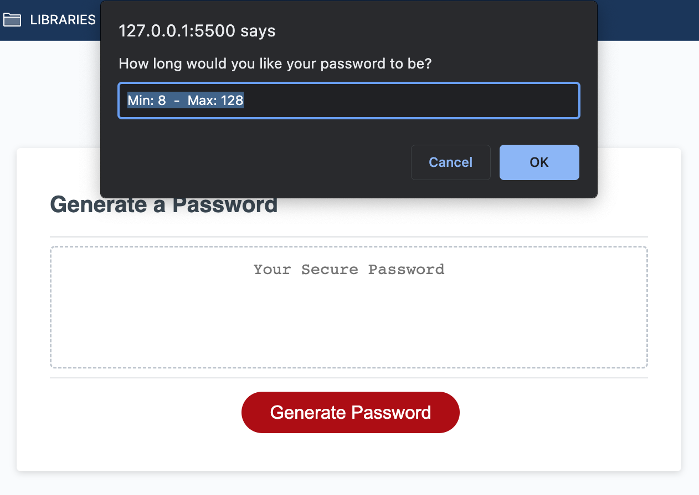
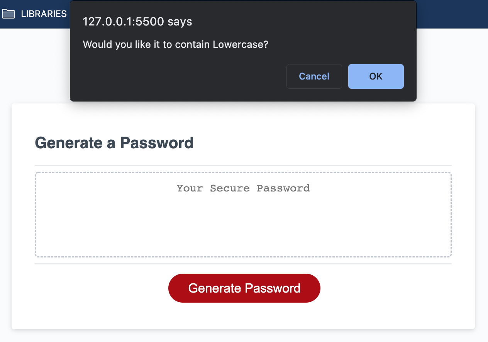
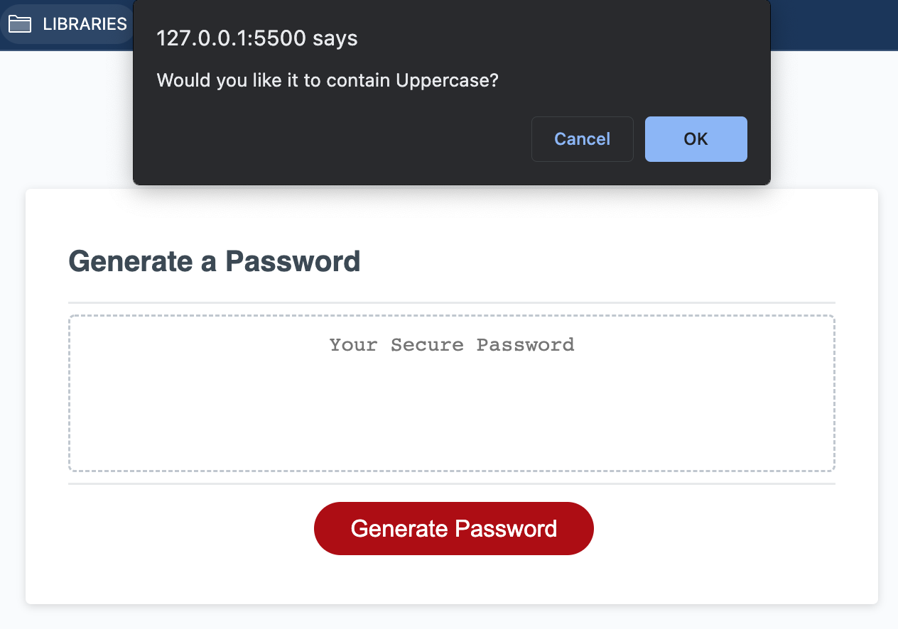
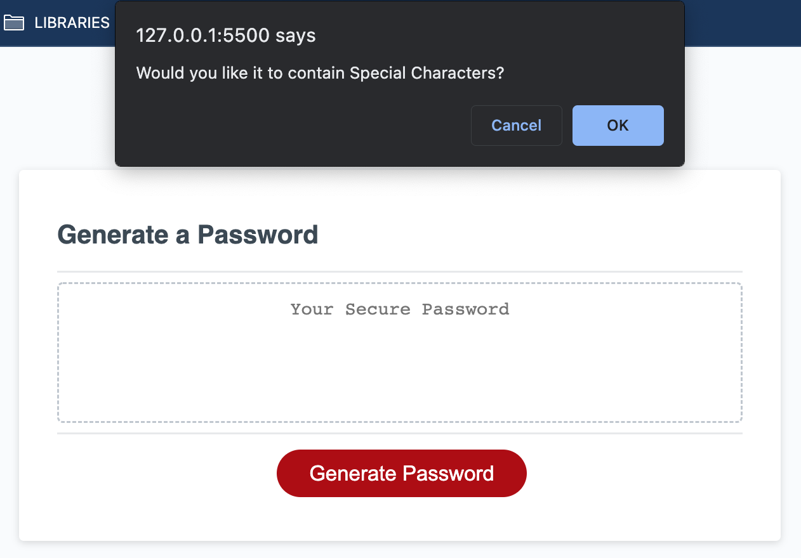

#

# **Vault Company | Password Generator**

## **App URL**

https://frygit87.github.io/Vault-Company_Password-Generator/

## **Goals**

Using onclick event listeners, to start functions that collect a selction of user input data to produce a password that matches the criteria of the input.

## **Tasks**

Provide a user-friendly synopsis of the out-going, motivated and resourceful individual that is Kym Reilly.

    ✅  Button clicking begins series of User prompts
    ✅  Length of password is prompted to the User, selection must be from 8 and 128.
    ✅  User is then prompted confirm whether or not to include lowercase.
    ✅  User is then prompted confirm whether or not to include uppercase.
    ✅  User is then prompted confirm whether or not to include numeric.
    ✅  User is then prompted confirm whether or not to include special characters.
    ✅  Alert to the User if at least one criteria is not selected.
    ✅  Password is generated and written to the page.
    ✅  Clicking the button once more, begins the process over again.

## **Web App**

